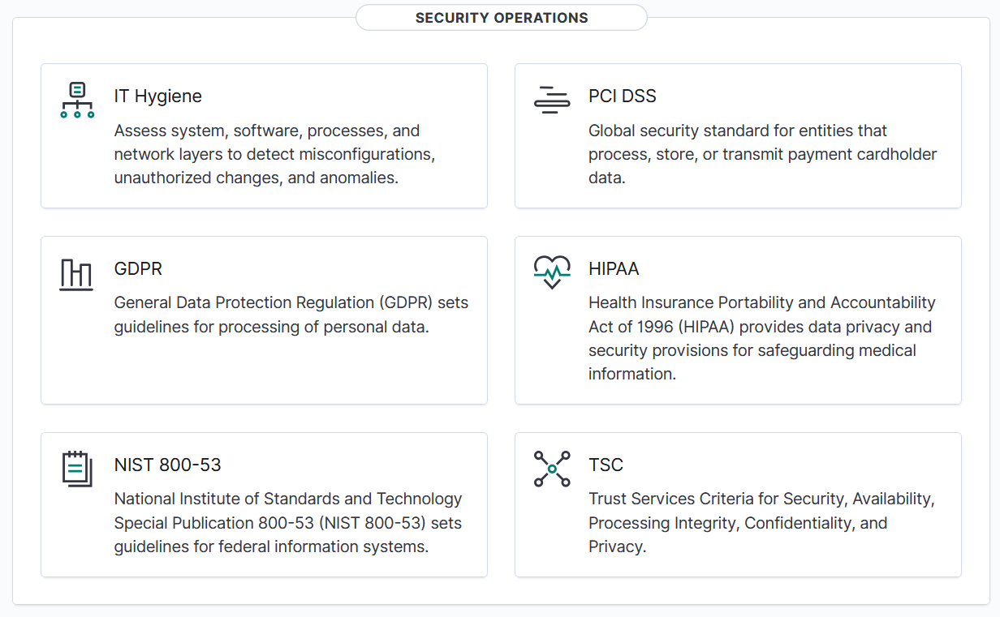
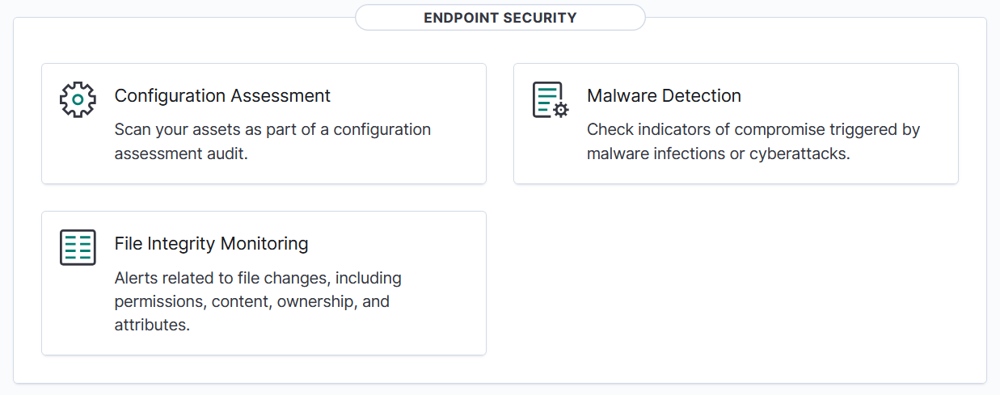
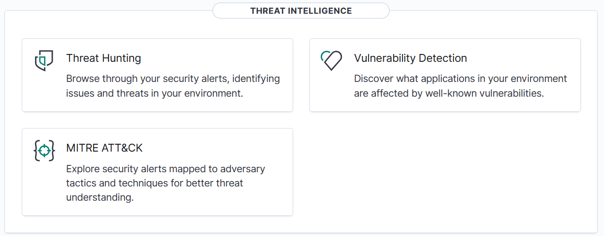
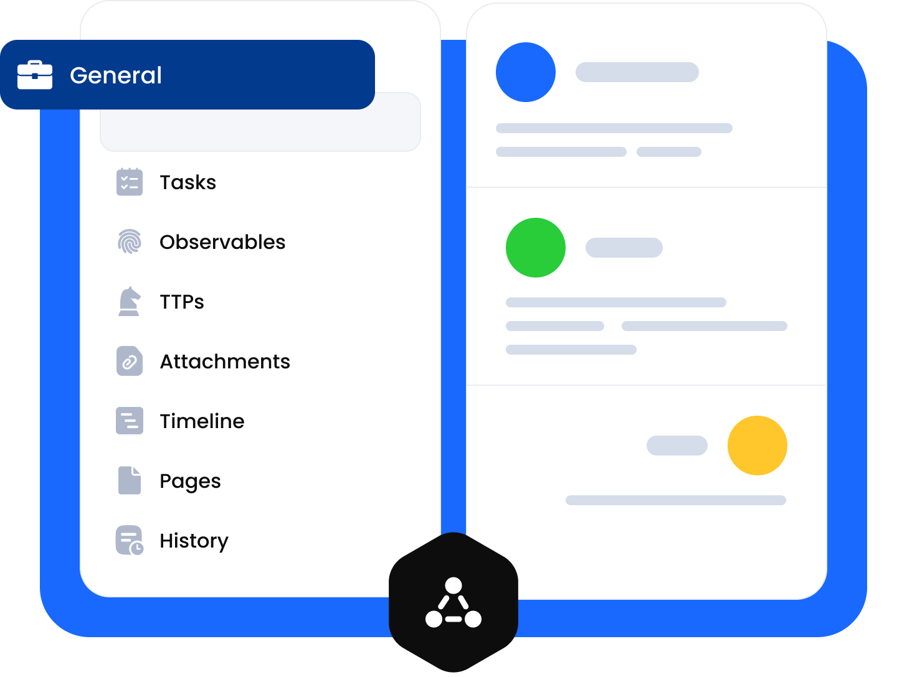
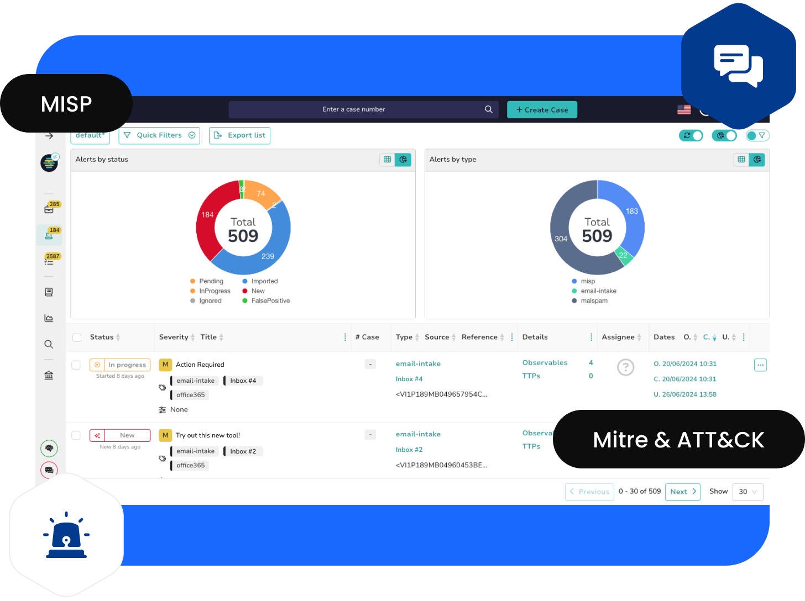
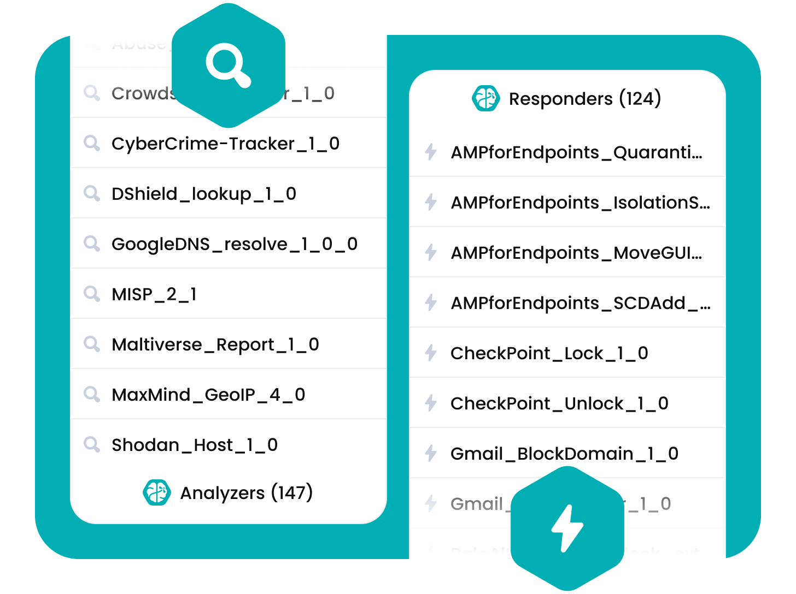
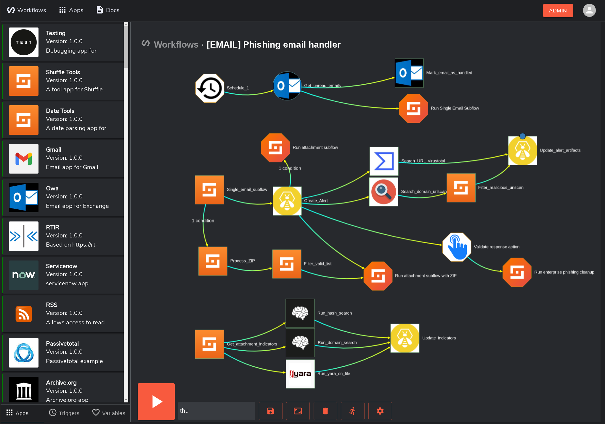
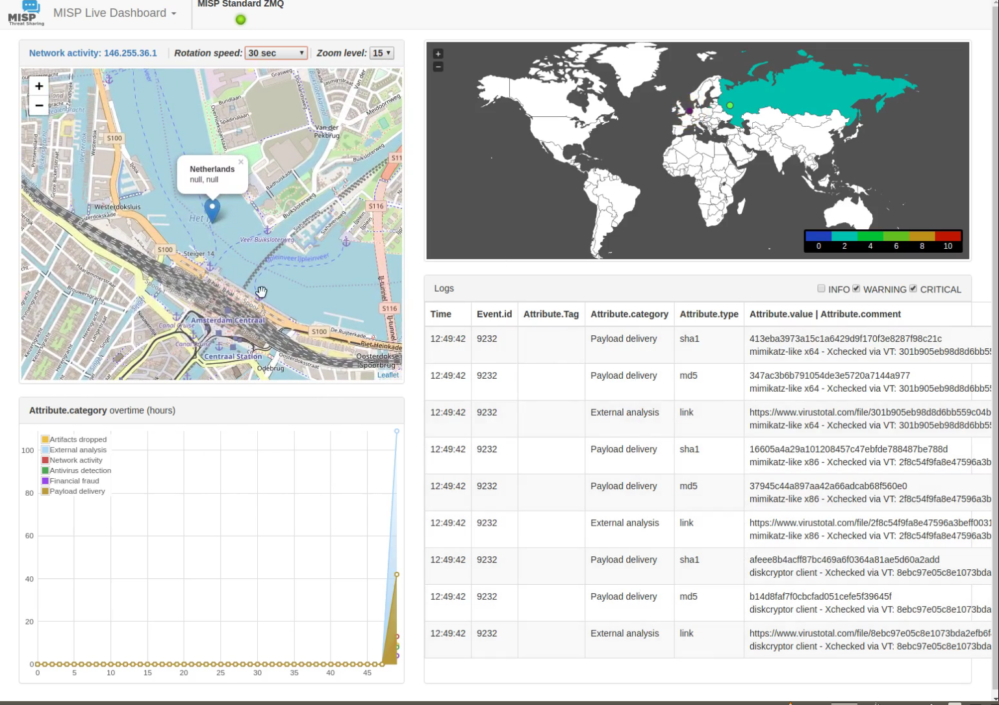
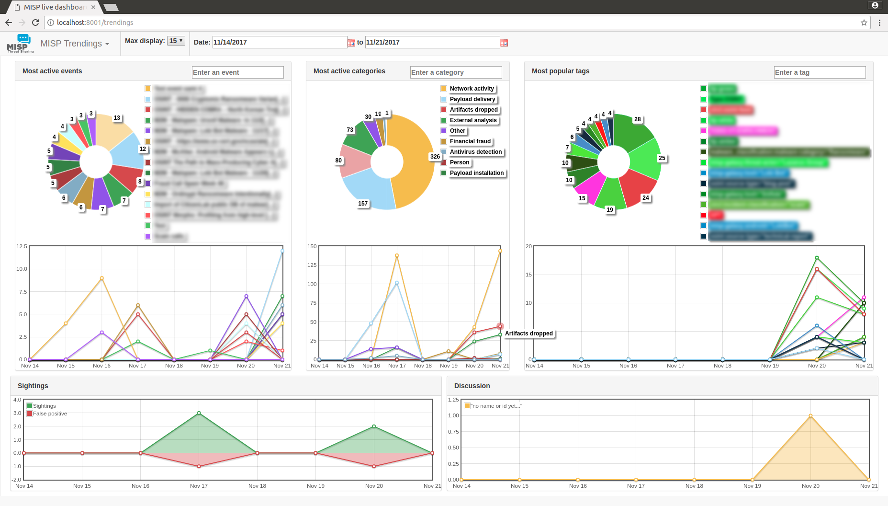

# 🧠 AI-Augmented SOC Lab

A full open-source Security Operations Center (SOC) lab enhanced with a local AI decision-support layer. Built for learning, research, and practical blue-team skill development.

---

## 📐 Architecture

```
Logs / Events
(Wazuh, Suricata, Zeek)
        ↓
   SIEM (Elastic via Wazuh)
        ↓
    Alert Trigger
        ↓
     Shuffle (SOAR)
        ↓
   Enrichment Phase
   ├─ MISP (threat intel)
   ├─ Cortex analyzers
   └─ External APIs
        ↓
   AI Engine (Ollama + LangChain)
        ↓
   Output:
   - Alert summary
   - Severity classification
   - MITRE ATT&CK mapping
   - Response recommendation
        ↓
   TheHive Case Creation
        ↓
   Analyst Decision / Automated Response
```

---

## 🛠️ Stack

| Component | Role |
|-----------|------|
| **Wazuh** | SIEM + EDR + Log aggregation |
| **Suricata** | Network IDS/IPS |
| **Zeek** | Network traffic analysis |
| **TheHive** | Case management |
| **Cortex** | Alert enrichment / analyzers |
| **Shuffle** | SOAR / workflow automation |
| **MISP** | Threat intelligence platform |
| **Ollama** | Local LLM inference (privacy-safe) |
| **LangChain** | AI pipeline orchestration |

---

## 📸 Screenshots

### Wazuh SIEM — Security Operations Dashboard
> Central hub for all security events, agent status, and compliance across your environment.



---

### Wazuh — Endpoint Security View
> Per-agent telemetry including vulnerability detection, FIM, and active threats.



---

### Wazuh — Threat Intelligence Panel
> Correlates alerts against known threat intel feeds and MITRE ATT&CK techniques.



---

### TheHive — Enriched Case Management
> Each AI-triaged alert auto-creates a structured case with playbook tasks and IOCs.



---

### TheHive — Centralized Alert Management
> All incoming alerts from Wazuh/Suricata are queued, prioritized, and assigned here.



---

### TheHive + Cortex — Automated Analysis & Response
> Cortex analyzers enrich alerts with VirusTotal, AbuseIPDB, and passive DNS lookups.



---

### Shuffle SOAR — Workflow Automation
> Drag-and-drop workflow connects Wazuh webhooks → MISP enrichment → AI Engine → TheHive case creation.



---

### MISP — Live Threat Intelligence Dashboard
> Real-time IOC feeds, event correlations, and threat actor tracking from the community.



---

### MISP — Trending Threat Indicators
> Tracks rising IOCs, malware families, and attack patterns across sharing communities.



---

### Ollama — Local LLM Interface (Open WebUI)
> Privacy-safe local AI model running LLaMA 3 / Mistral — no data leaves your network.


---

## ⚙️ AI Use Cases

### 1. Alert Summarization
Converts raw log data into structured, analyst-readable summaries with MITRE ATT&CK mapping.

### 2. False Positive Reduction
AI filters known scanners, internal vulnerability scans, and maintenance window traffic.

### 3. Automated Triage (L1 Replacement Layer)
AI classifies alerts as: `CLOSE` / `ESCALATE` / `ENRICH` — with confidence score.

### 4. Playbook Generation
Given an alert type, AI generates a step-by-step incident response workflow.

### 5. Natural Language SIEM Queries
Ask questions in plain English and get Elasticsearch DSL queries back.

---

## 🚀 Quick Start

### Prerequisites

- Docker + Docker Compose
- 16 GB RAM minimum (32 GB recommended)
- 100 GB disk space
- Linux (Ubuntu 22.04 recommended) or WSL2

### 1. Clone the repo

```bash
git clone https://github.com/sandeepmothukuri/ai-soc-lab.git
cd ai-soc-lab
```

### 2. Deploy the core stack

```bash
chmod +x scripts/deploy.sh
./scripts/deploy.sh
```

### 3. Pull the AI model

```bash
./scripts/setup-ollama.sh
```

### 4. Start the AI engine

```bash
cd ai-engine
pip install -r requirements.txt
python app.py
```

### 5. Import Shuffle workflows

Import the JSON files from `shuffle-workflows/` into your Shuffle instance.

---

## 📁 Project Structure

```
ai-soc-lab/
├── docker/                    # Docker Compose configs per service
│   ├── docker-compose.wazuh.yml
│   ├── docker-compose.thehive.yml
│   ├── docker-compose.shuffle.yml
│   ├── docker-compose.misp.yml
│   └── docker-compose.ollama.yml
├── ai-engine/                 # Python AI pipeline
│   ├── app.py                 # FastAPI server
│   ├── analyzer.py            # Core alert analysis logic
│   ├── prompts/               # LLM prompt templates
│   │   ├── triage.txt
│   │   ├── summary.txt
│   │   └── playbook.txt
│   └── requirements.txt
├── shuffle-workflows/         # SOAR automation workflows
│   ├── ssh-bruteforce.json
│   ├── malware-detection.json
│   └── data-exfiltration.json
├── wazuh-config/              # Custom Wazuh rules and decoders
│   ├── custom-rules.xml
│   └── ossec.conf
├── thehive-config/            # TheHive case templates
│   └── case-templates.json
├── scripts/                   # Deployment and utility scripts
│   ├── deploy.sh
│   ├── setup-ollama.sh
│   ├── test-pipeline.sh
│   └── send-test-alert.py
└── docs/                      # Extended documentation
    ├── setup-guide.md
    ├── ai-prompts.md
    ├── mitre-mapping.md
    └── screenshots/           # All UI screenshots
```

---

## 🔐 Security Considerations

- All LLM inference runs **locally via Ollama** — no data leaves your network
- AI output is **advisory only** — analysts retain final decision authority
- Every AI decision is **logged with timestamp, confidence score, and reasoning**
- Avoid sending raw logs to cloud-based LLMs

---

## 📊 Day-by-Day Build Plan

| Day | Task |
|-----|------|
| 1-2 | Deploy Wazuh + connect endpoints |
| 3 | Deploy TheHive + Cortex |
| 4 | Deploy Shuffle + configure webhooks |
| 5 | Install Ollama + pull LLaMA 3 |
| 6-7 | Connect pipeline: Shuffle → AI Engine → TheHive |

---

## 🤖 Supported AI Models (via Ollama)

| Model | Size | Best For |
|-------|------|----------|
| `llama3` | 8B | General triage, balanced |
| `mistral` | 7B | Fast triage, low RAM |
| `phi3` | 3.8B | Minimal resources |
| `llama3:70b` | 70B | High-accuracy analysis |

---

## 📜 License

MIT — free to use, modify, and share.

---

## 🤝 Contributing

Pull requests welcome. See [docs/setup-guide.md](docs/setup-guide.md) to get started.

---

## 👤 Author

**Sandeep Mothukuri**
- GitHub: [@sandeepmothukuri](https://github.com/sandeepmothukuri)
- Portfolio: [github.com/sandeepmothukuri](https://github.com/sandeepmothukuri)

---

## 🗂️ All Repositories

| Repository | Description |
|---|---|
| [ai-soc-lab](https://github.com/sandeepmothukuri/ai-soc-lab) | AI-augmented SOC with Wazuh + TheHive + Ollama (LLaMA3) for automated triage |
| [advanced-soc-forge](https://github.com/sandeepmothukuri/advanced-soc-forge) | 12-tool SOC lab with OpenSearch, Suricata, Zeek, MISP, Caldera, Velociraptor |
| [Autonomous-SOC-Lab](https://github.com/sandeepmothukuri/Autonomous-SOC-Lab) | Autonomous SOC with AI-driven detection and self-healing playbooks |
| [soc-threat-hunting-lab](https://github.com/sandeepmothukuri/soc-threat-hunting-lab) | Threat detection lab — Zeek, RITA, Arkime, Velociraptor, OSQuery, MISP |
| [soc-lab-free](https://github.com/sandeepmothukuri/soc-lab-free) | Free SOC lab — OpenVAS, Wazuh, pfSense, Proxmox Mail, Lynis |
| [soc-lab](https://github.com/sandeepmothukuri/soc-lab) | SOC analyst home lab — Wazuh SIEM, Sysmon, MITRE ATT&CK mapping |
| [cyberblue](https://github.com/sandeepmothukuri/cyberblue) | Containerised blue team platform — SIEM, DFIR, CTI, SOAR, Network Analysis |
